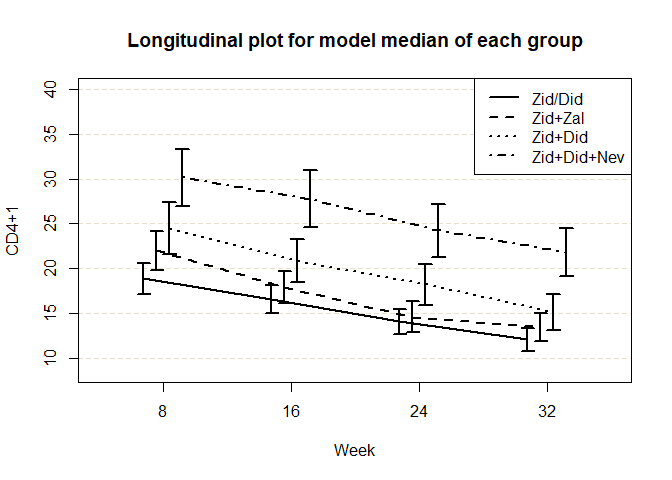

<!-- README.md is generated from README.Rmd. Please edit that file -->

# bcmixed

<!-- badges: start -->

[](https://travis-ci.org/kzkzmr/bcmixed)
<!-- badges: end -->

The goal of bcmixed is to conduct inferences on the marginal model of
the mixed effect model with the Box-Cox transformation and/or on the
model median differences between treatment groups for longitudinal
randomized clinical trials.

## Installation

You can install the released version of bcmixed from
[CRAN](https://CRAN.R-project.org) with:

``` r
install.packages("bcmixed")
```

And the development version from [GitHub](https://github.com/) with:

``` r
# install.packages("devtools")
devtools::install_github("kzkzmr/bcmixed")
```

## Example

This is a basic example which shows you how to solve a common problem:

``` r
library(bcmixed)
data(aidscd4)
# Marginal model of mixed model with the Box-Cox transformation
res1 <- bcmarg(cd4 ~ as.factor(treatment) * as.factor(weekc) + age,
       data = aidscd4, time = weekc, id = id)
summary(res1)
#> Box-Cox transformed mixed model analysis
#>   Formula: cd4 ~ as.factor(treatment) * as.factor(weekc) + age 
#>   Time: weekc 
#>   ID: id 
#>   Covariance structure: "UN" 
#>   Data: aidscd4 
#>   Log-likelihood: -13623.31
#>   Estimated transformation parameter:  0.183 
#> 
#> Coefficients on the transformed scale:
#>                                            Value Std.Error t-value p-value
#> (Intercept)                               3.1483   0.25917  12.147   0.000
#> as.factor(treatment)2                     0.2967   0.16995   1.746   0.081
#> as.factor(treatment)3                     0.4716   0.16946   2.783   0.005
#> as.factor(treatment)4                     0.7614   0.16763   4.542   0.000
#> as.factor(weekc)16                       -0.2254   0.09248  -2.437   0.015
#> as.factor(weekc)24                       -0.4863   0.09781  -4.972   0.000
#> as.factor(weekc)32                       -0.7246   0.10834  -6.688   0.000
#> age                                       0.0207   0.00612   3.384   0.001
#> as.factor(treatment)2:as.factor(weekc)16 -0.1386   0.12994  -1.067   0.286
#> as.factor(treatment)3:as.factor(weekc)16 -0.0500   0.12943  -0.387   0.699
#> as.factor(treatment)4:as.factor(weekc)16  0.0682   0.12896   0.529   0.597
#> as.factor(treatment)2:as.factor(weekc)24 -0.2078   0.13763  -1.510   0.131
#> as.factor(treatment)3:as.factor(weekc)24 -0.0235   0.13758  -0.171   0.864
#> as.factor(treatment)4:as.factor(weekc)24  0.0821   0.13754   0.597   0.551
#> as.factor(treatment)2:as.factor(weekc)32 -0.1034   0.15508  -0.667   0.505
#> as.factor(treatment)3:as.factor(weekc)32 -0.1018   0.15353  -0.663   0.507
#> as.factor(treatment)4:as.factor(weekc)32  0.1436   0.15162   0.947   0.344
#> 
#>  *NOTE* : Inference results under the assumption that 
#>           the transformation parameter is known are provided.
#>           Although statistical tests would be asymptotically
#>           valid, standard errors might be underestimated.
#> 
#> Covariance parameters on the transformed scale:
#> UN(1,1) UN(1,2) UN(1,3) UN(1,4) UN(2,2) UN(2,3) UN(2,4) UN(3,3) UN(3,4) UN(4,4) 
#>    3.72    2.76    2.61    2.34    3.47    2.67    2.56    3.24    2.68    3.27 
#> 
#> Correlations on the transformed scale:
#>        8    16    24    32
#> 8  1.000 0.767 0.751 0.670
#> 16 0.767 1.000 0.797 0.761
#> 24 0.751 0.797 1.000 0.821
#> 32 0.670 0.761 0.821 1.000

# Box-Cox transformation for the baseline
lmd.bl <- bcmarg(cd4.bl ~ 1, data = aidscd4[aidscd4$weekc == 8, ])$lambda
aidscd4$cd4.bl.tr <- bct(aidscd4$cd4.bl, lmd.bl)

# Inference on model median differences between groups at each time point
res2 <- bcmmrm(outcome = cd4, group = treatment, data = aidscd4, time = weekc,
       id = id, covv = c("cd4.bl.tr", "sex"), cfactor = c(0, 1),
       glabel = c("Zid/Did", "Zid+Zal", "Zid+Did", "Zid+Did+Nev"))

# Summarize
print(res2)
#> Model median estimation based on MMRM with Box-Cox transformation
#>   Outcome: cd4 
#>   Group: treatment 
#>   Time: weekc 
#>   ID: id 
#>   Covariate(s): c("cd4.bl.tr", "sex") 
#>   Covariance structure: "UN" 
#>   Data: aidscd4 
#>   Estimated transformation parameter:  0.154 
#>   Log-likelihood: -13322.36
#> 
#> Model median estimates (row: group, col: time):
#>   treatment | weekc    8   16   24   32
#> 1           Zid/Did 18.9 16.5 14.1 12.1
#> 2           Zid+Zal 22.0 17.9 14.6 13.5
#> 3           Zid+Did 24.5 20.9 18.2 15.1
#> 4       Zid+Did+Nev 30.1 27.8 24.2 21.8

summary(res2)
#> Model median inference based on MMRM with Box-Cox transformation
#> 
#> Data and variable information:
#>   Outcome: cd4 
#>   Group: treatment 
#>   Time: weekc 
#>   ID: id 
#>   Covariate(s): c("cd4.bl.tr", "sex") 
#>   Data: aidscd4 
#> 
#> Analysis information:
#>   Covariance structure: "UN" 
#>   Robust inference: TRUE 
#>   Empirical small sample adjustment: TRUE 
#>   Confidence level: 0.95 
#> 
#> Analysis results:
#>   Estimated transformation parameter:  0.154 
#> 
#>  
#> Model median inferences for weekc = 8 
#>  
#>     treatment median    SE lower.CL upper.CL
#> 1     Zid/Did   18.9 0.862     17.2     20.6
#> 2     Zid+Zal   22.0 1.124     19.8     24.2
#> 3     Zid+Did   24.5 1.465     21.6     27.4
#> 4 Zid+Did+Nev   30.1 1.597     27.0     33.3
#> 
#>  
#> Model median inferences for weekc = 16 
#>  
#>     treatment median    SE lower.CL upper.CL
#> 1     Zid/Did   16.5 0.799     15.0     18.1
#> 2     Zid+Zal   17.9 0.932     16.1     19.8
#> 3     Zid+Did   20.9 1.207     18.5     23.2
#> 4 Zid+Did+Nev   27.8 1.596     24.6     30.9
#> 
#>  
#> Model median inferences for weekc = 24 
#>  
#>     treatment median    SE lower.CL upper.CL
#> 1     Zid/Did   14.1 0.716     12.7     15.5
#> 2     Zid+Zal   14.6 0.864     12.9     16.3
#> 3     Zid+Did   18.2 1.175     15.9     20.5
#> 4 Zid+Did+Nev   24.2 1.510     21.3     27.2
#> 
#>  
#> Model median inferences for weekc = 32 
#>  
#>     treatment median    SE lower.CL upper.CL
#> 1     Zid/Did   12.1 0.662     10.8     13.4
#> 2     Zid+Zal   13.5 0.813     11.9     15.1
#> 3     Zid+Did   15.1 1.019     13.1     17.1
#> 4 Zid+Did+Nev   21.8 1.376     19.1     24.5
#> 
#>  
#> Inferences of model median difference between groups ( treatment 1 - treatment 0 ) for weekc = 8 
#>  
#>   treatment 1 treatment 0 delta   SE lower.CL upper.CL t.value p.value
#> 1     Zid+Zal     Zid/Did  3.12 1.40    0.363     5.87    2.22   0.027
#> 2     Zid+Did     Zid/Did  5.64 1.69    2.325     8.96    3.34   0.001
#> 3 Zid+Did+Nev     Zid/Did 11.25 1.80    7.711    14.80    6.24   0.000
#> 4     Zid+Did     Zid+Zal  2.53 1.83   -1.059     6.12    1.39   0.167
#> 5 Zid+Did+Nev     Zid+Zal  8.14 1.93    4.349    11.93    4.22   0.000
#> 6 Zid+Did+Nev     Zid+Did  5.61 2.16    1.372     9.85    2.60   0.010
#> 
#>  
#> Inferences of model median difference between groups ( treatment 1 - treatment 0 ) for weekc = 16 
#>  
#>   treatment 1 treatment 0 delta   SE lower.CL upper.CL t.value p.value
#> 1     Zid+Zal     Zid/Did  1.38 1.21  -1.0015     3.75    1.14   0.256
#> 2     Zid+Did     Zid/Did  4.31 1.43   1.4940     7.12    3.01   0.003
#> 3 Zid+Did+Nev     Zid/Did 11.22 1.78   7.7118    14.73    6.29   0.000
#> 4     Zid+Did     Zid+Zal  2.93 1.50  -0.0162     5.88    1.95   0.051
#> 5 Zid+Did+Nev     Zid+Zal  9.84 1.84   6.2318    13.46    5.36   0.000
#> 6 Zid+Did+Nev     Zid+Did  6.91 2.00   2.9767    10.84    3.45   0.001
#> 
#>  
#> Inferences of model median difference between groups ( treatment 1 - treatment 0 ) for weekc = 24 
#>  
#>   treatment 1 treatment 0  delta   SE lower.CL upper.CL t.value p.value
#> 1     Zid+Zal     Zid/Did  0.534 1.12   -1.660     2.73   0.479   0.632
#> 2     Zid+Did     Zid/Did  4.139 1.36    1.459     6.82   3.035   0.003
#> 3 Zid+Did+Nev     Zid/Did 10.135 1.66    6.874    13.40   6.108   0.000
#> 4     Zid+Did     Zid+Zal  3.605 1.44    0.768     6.44   2.498   0.013
#> 5 Zid+Did+Nev     Zid+Zal  9.601 1.73    6.204    13.00   5.554   0.000
#> 6 Zid+Did+Nev     Zid+Did  5.996 1.89    2.291     9.70   3.180   0.002
#> 
#>  
#> Inferences of model median difference between groups ( treatment 1 - treatment 0 ) for weekc = 32 
#>  
#>   treatment 1 treatment 0 delta   SE lower.CL upper.CL t.value p.value
#> 1     Zid+Zal     Zid/Did  1.35 1.04   -0.692     3.40    1.30   0.194
#> 2     Zid+Did     Zid/Did  3.00 1.20    0.633     5.37    2.49   0.013
#> 3 Zid+Did+Nev     Zid/Did  9.70 1.52    6.705    12.69    6.37   0.000
#> 4     Zid+Did     Zid+Zal  1.65 1.30   -0.907     4.20    1.27   0.206
#> 5 Zid+Did+Nev     Zid+Zal  8.34 1.60    5.206    11.48    5.23   0.000
#> 6 Zid+Did+Nev     Zid+Did  6.70 1.71    3.338    10.06    3.92   0.000

plot(res2, ylab = "CD4+1", xlab = "Week")
```



    #> Analysis information:
    #>   Covariance structure: "UN" 
    #>   Robust inference: TRUE 
    #>   Empirical small sample adjustment: TRUE 
    #> 
    #> Error bar: 95% confidence interval
